**#命题：精品之家-家具商城**

**1.项目平台：PC端**

**2.问题描述：**
对于现在的淘宝、京东、拼多多等网上购物平台，它们的品类广泛，当我们想要集中搜索一类商品时，往往会很麻烦，而如果去一个品牌的官方网站，那么能浏览的商品就很有限。所以，特此做出一个专门对于家居饰品的网上购物平台。

**3.解决方案：**
首先搭建购物网站，设置登录，注册用户，主要功能模块分为首页、商品分类、个人中心、订单中心、购物车功能以及在线购买等一条龙服务。用户能够足不出户实现在线购买家装家饰用品，可以随时随地浏览商品信息、加入购物车、在线购买、编辑个人资料等，页面采用HTML,CSS,JQuery,Swipper.js,SuperSlide.js等插件和技术，以实现该购物平台的主要功能。

**项目成员：**
   ●丁佳云  组长

**项目描述：**
实现一个家居家饰的购物网站，提供登录，注册用户，主要功能模块分为首页、商品分类、个人中心、订单中心、购物车功能以及在线购买等一条龙服务。用户能够足不出户实现在线购买家居家饰用品，可以随时随地浏览商品信息、加入购物车、在线购买和付款、编辑和修改个人资料等。

**界面设计：**

**1.首页界面：**

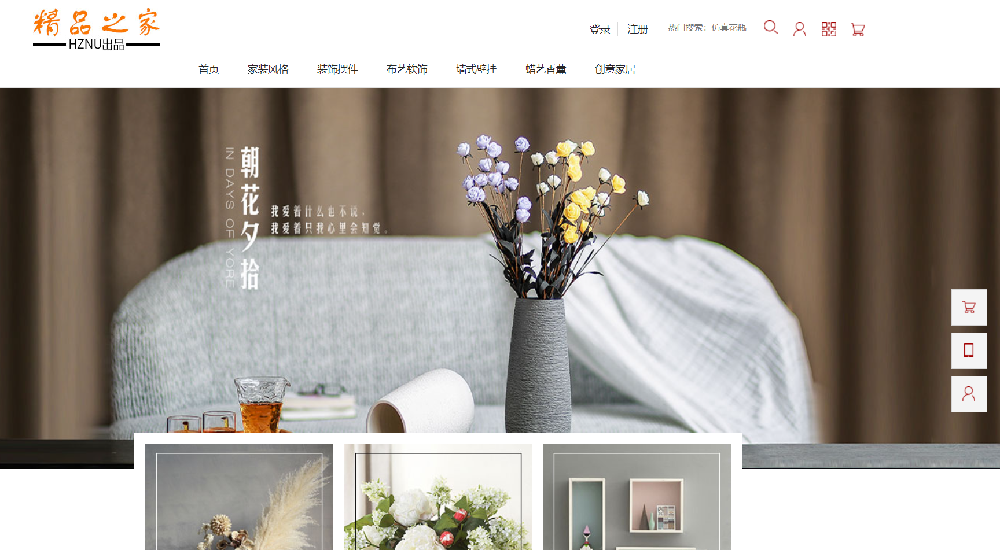

**2.登录界面：**

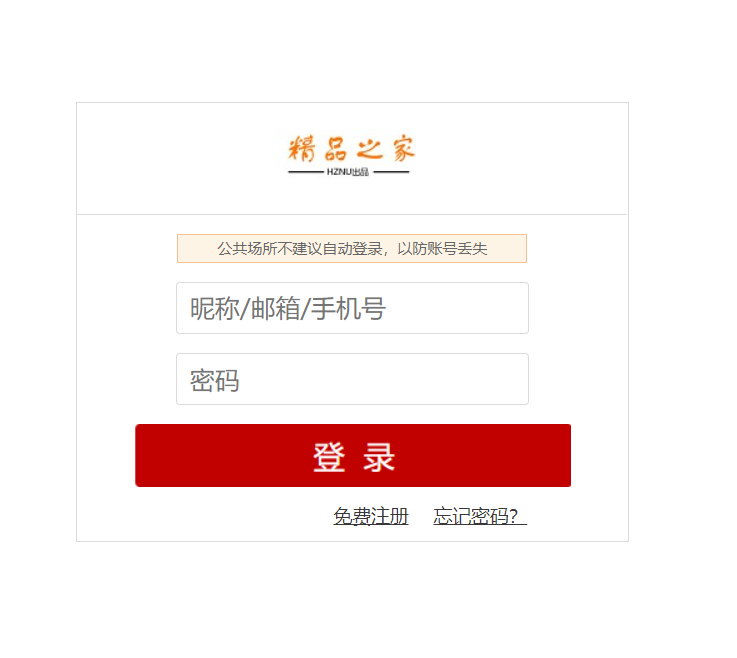

**3.注册界面：**

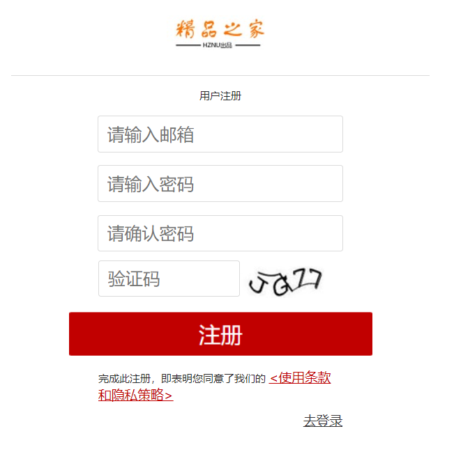

**4.布艺界面：**

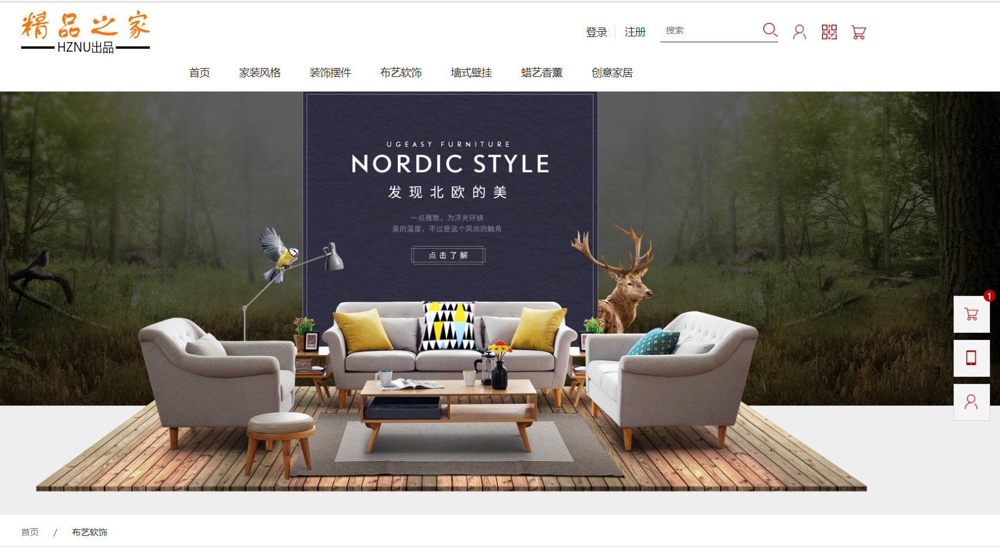

**5.猜你喜欢界面：**

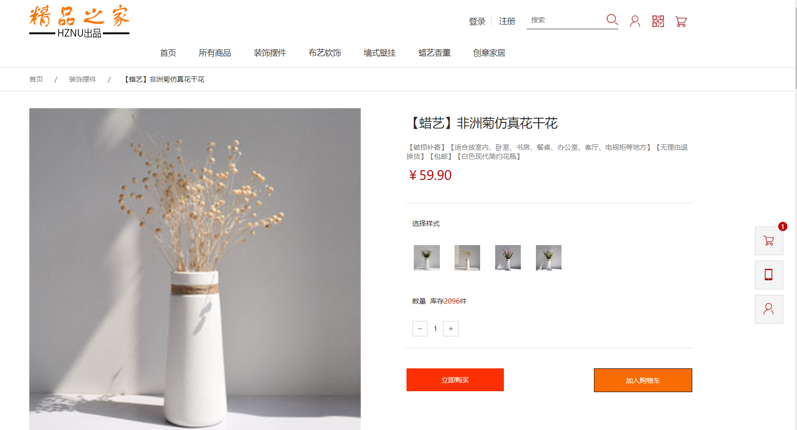

**6.创意家居界面：**

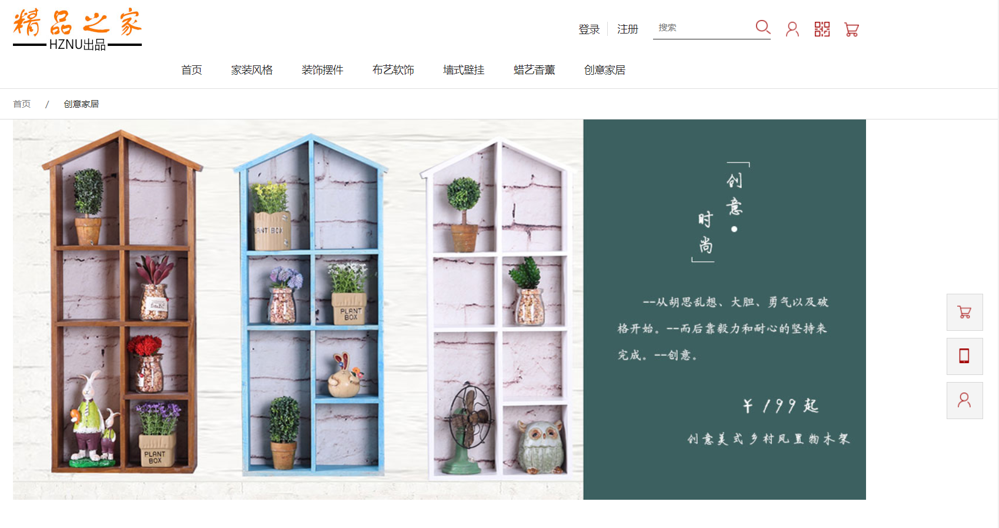

**7.地址管理界面：**

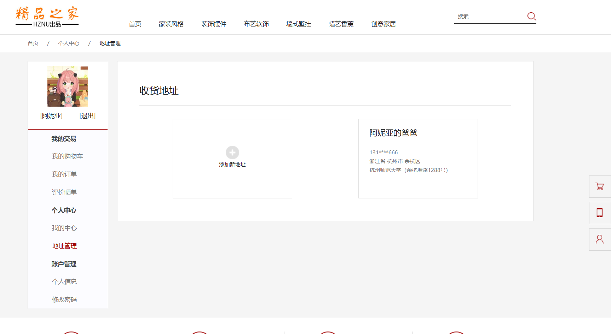

**8.订单页界面：**

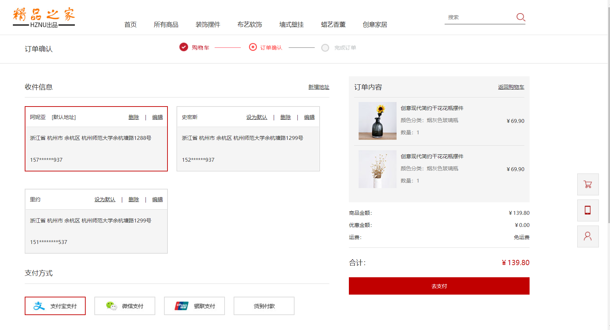

**9.个人信息界面：**

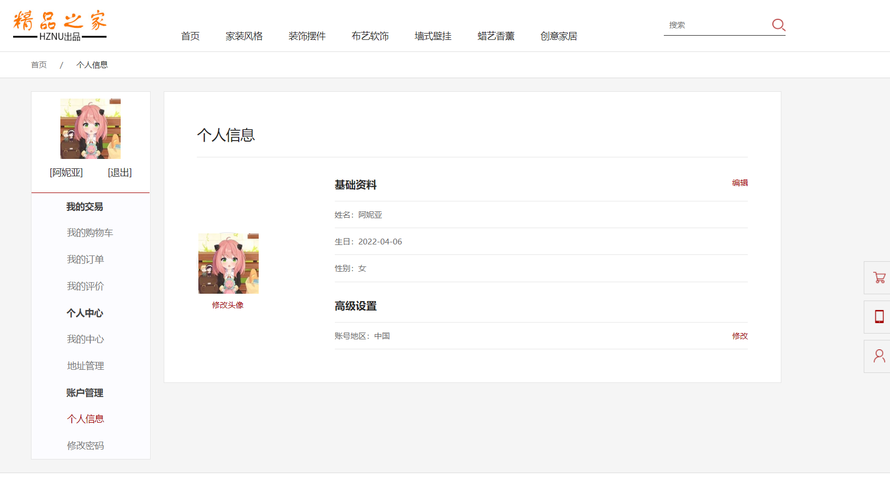

**10.个人中心界面：**

**11.购物车界面：**

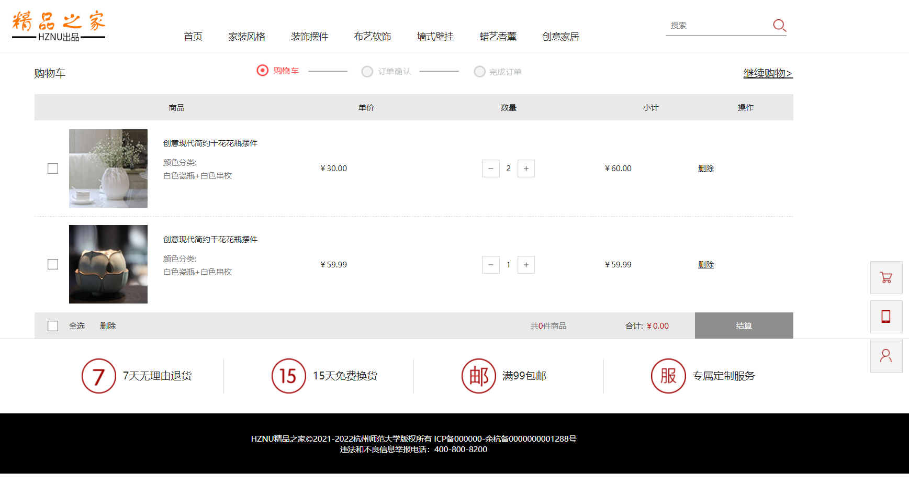

**12.家装风格界面：**

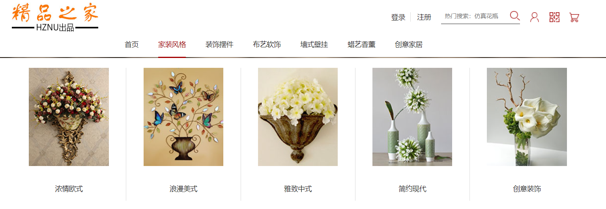

**13.蜡艺界面：**

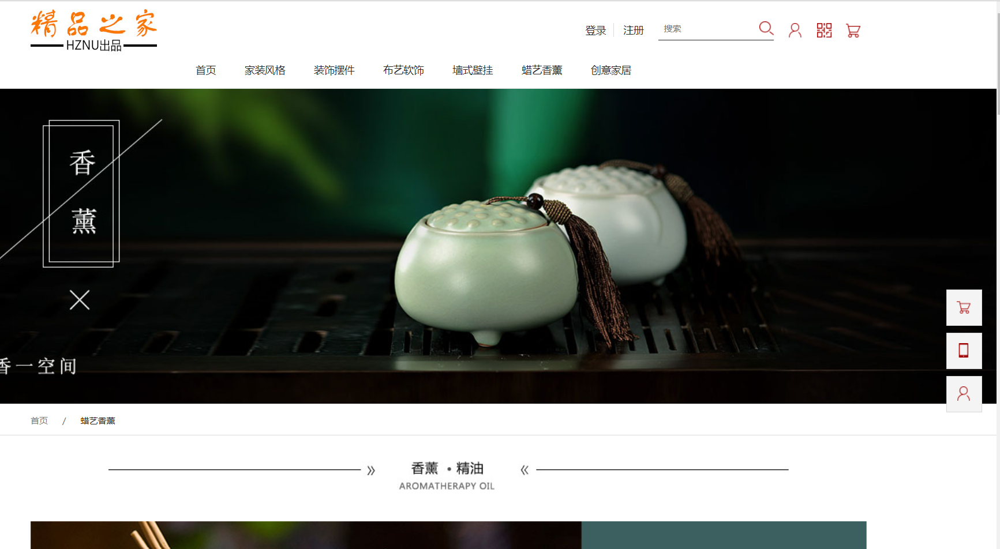

**14.详情页界面：**

**15.装饰摆件界面：**

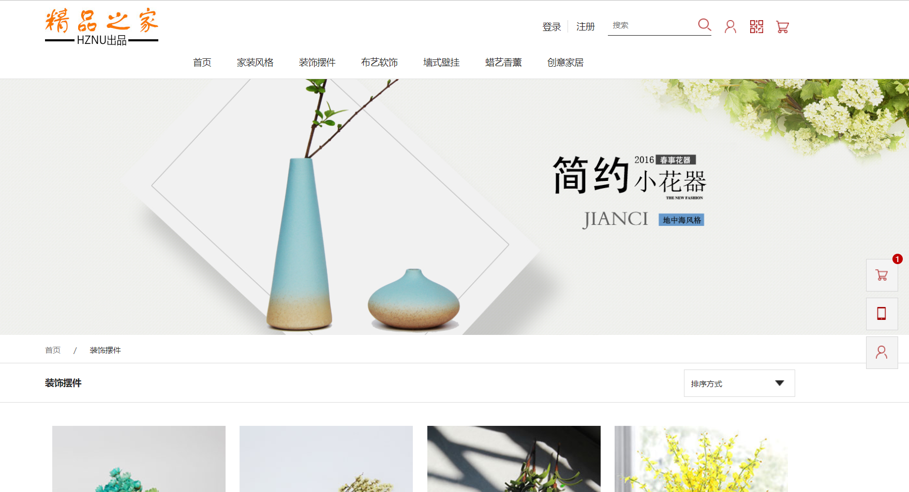

**数据结构：**

**1.商品表：**

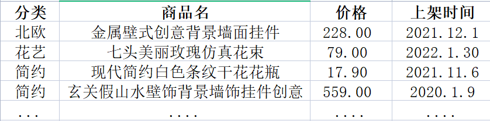

**2.订单表：**

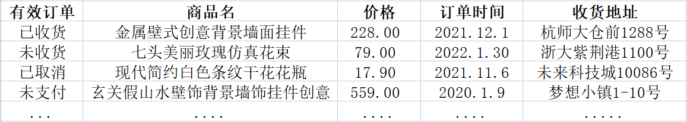

**3.地址表：**

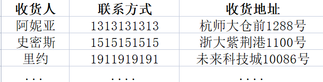

**功能模块：**

**1.商品列表：**

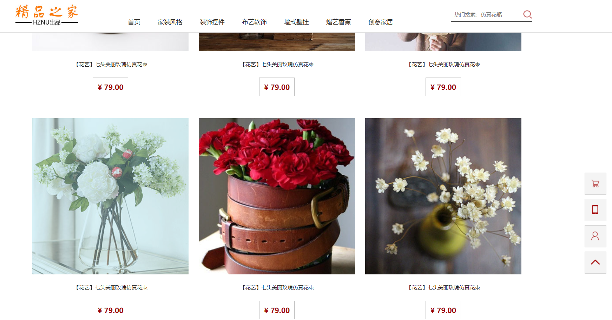

**2.订单列表：**

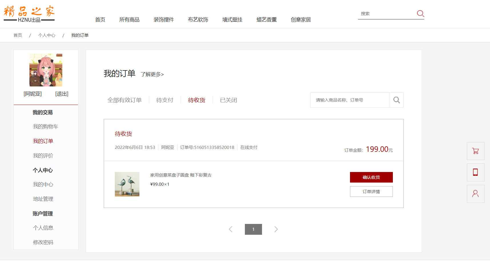

**3.地址列表：**

**4.购物车列表：**

